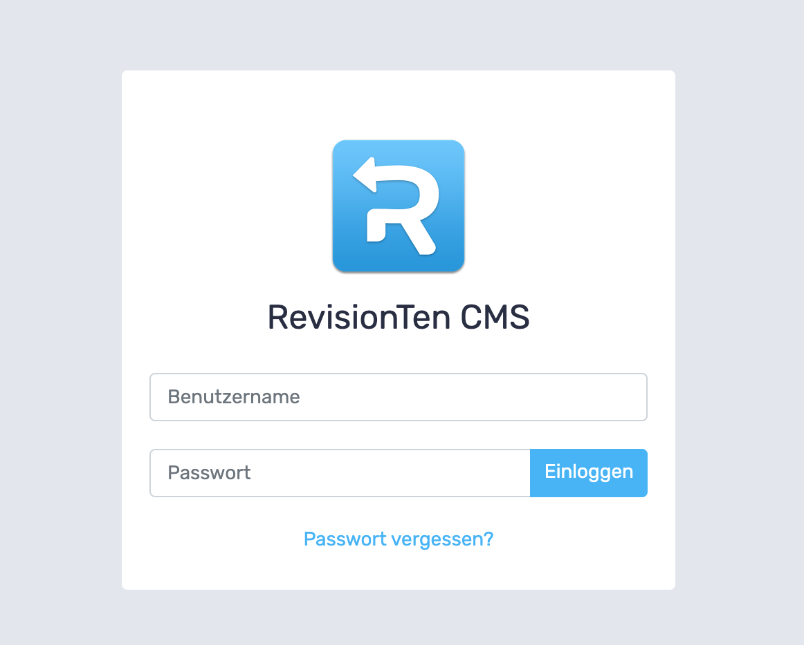


# RevisionTen Dokumentation

## 2.Anmeldung 
Wir haben euch eine Seite eingerichtet und ihr habt keine Lust wegen kleinen Änderungen uns immer Bescheid geben zu müssen? Gut! Mit RevisionTen könnt ihr ganz leicht selber Änderungen vornehmen. Die Anmeldung erfolgt über beispiel.de/login. 

Hier gibt man einfach seine Anmeldedaten ein und muss je nach Konfiguration noch eine zweite Authentifikation durchführen wie z. B. durch einen Code, der per Mail, oder 2-Wege-Authentifikationssysteme bereitgestellt wird. 

