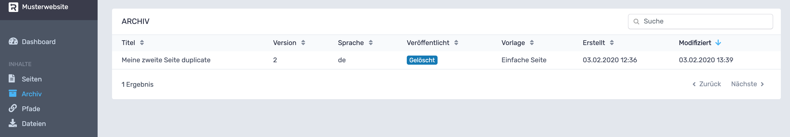

# RevisionTen Dokumentation!
## Archiv

In der Sidebar unter der Kategorie: Inhalte ist der Reiter: Archiv zu finden. 
Hier werden gelöschte Seiten aufgelistet. Es wird der Titel, die Version, die Sprache, 
ob die Seite veröffentlicht ist, 
die für die Seite benutzte Vorlage, das Erstellungs- und Modifizierungsdatum angezeigt. 