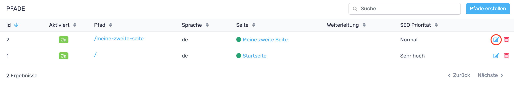
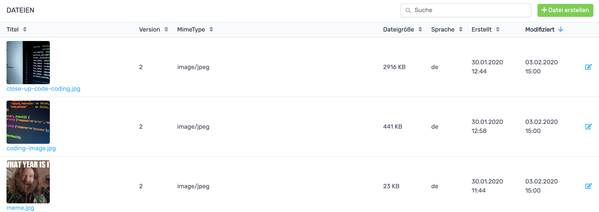
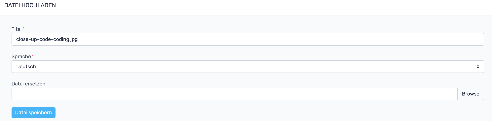

# RevisionTen Dokumentation
## 9. Dateien

In der Sidebar unter der Kategorie: Inhalte ist der Reiter: Dateien zu finden. 
Hier können Dateien hochgeladen und/oder umbenannt werden. In der Dateiübersicht werden alle Dateien angezeigt, 
die beim Erstellen von Seiten wie z. B. Bilder, PDFs usw. hochgeladen worden sind. 
### Dateien hochladen

Um eine neue Datei anzulegen, muss in der Dateiübersicht auf den Datei-erstellen-Button geklickt werden. 
Es öffnet sich ein Fenster, in dem der Titel, die Sprache und die Datei ausgewählt werden werden kann. 
### Datei bearbeiten

Das Fenster, das sich beim Klick auf den Bearbeiten-Button der jeweiligen Datei in der Tabelle öffnet 
entspricht dem Fenster, das durch einen Klick auf Datei-erstellen aufgerufen wird. 
Unterschied besteht darin, dass bereits eine Datei hinterlegt ist. Man sollte den Dateien immer einen treffenden
 Namen geben. Oftmals haben Bilder, die man auf der Seite hochgeladen hat keinen treffenden Namen. 
 Für google & co sind eine sinnvolle Dateibenennung aber wichtig, weshalb die Umbenennungsfunktion der beste 
 Freund deines SEOs ist!