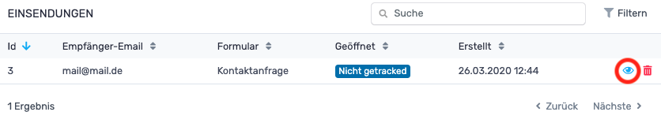
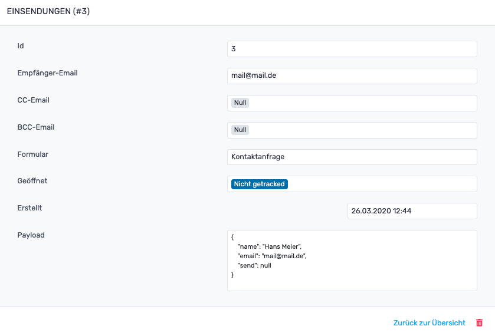

# RevisionTen Dokumentation
## 13. Einsendungen

In der Sidebar unter der Kategorie: Struktur ist der Reiter: Einsendungen zu finden. 
Hier können eingegangene Formulare eingesehen und gelöscht werden. 
Um eine Einsendung einzusehen, muss der blaue Augen-Button geklickt werden. 

Es öffnet sich ein Fenster, in welchem die Einzelheiten zur Einsendung eingesehen werden können. Zu diesen Einzelheiten gehören:
1. ID (Die wievielte Einsendung ist das)
2. die Empfänger Email 
3. die CC-Emails (welchen Emails wird eine Kopie gesendet)
4. BCC-Emails (welchen Emails wird eine Kopie gesendet ohne, dass man sieht wer diese Kopie noch bekommen hat)
5. der Name des Formulars
6. wenn die Einsendung getrackt wurde, ob die Mail gelesen wurde
7. wann das Formular versandt worden ist
8. und welche Daten mit dem Formular gesendet worden sind

Möchte man zurück zur Einsendungsliste, kann einfach auf "Zurück zur Übersicht" geklickt werden. Per Klick auf den roten Mülleimer-Button wird die Einsendung gelöscht.

