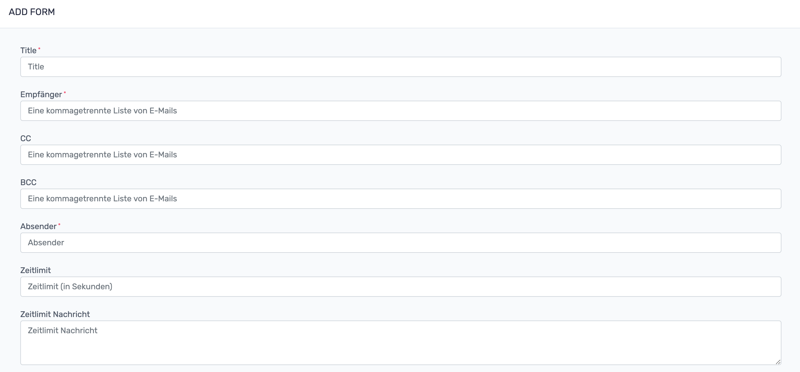
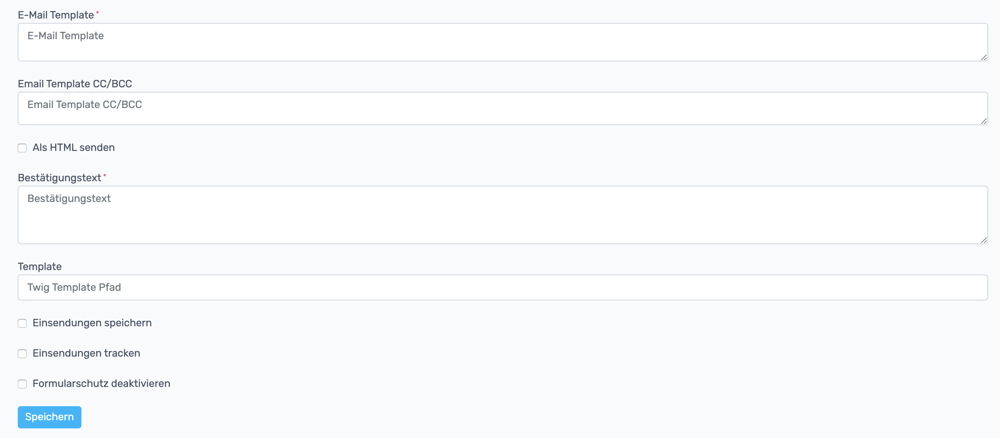
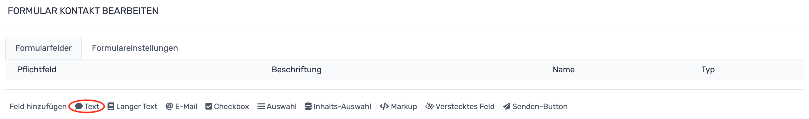
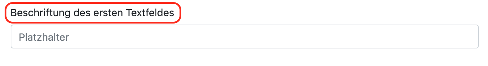
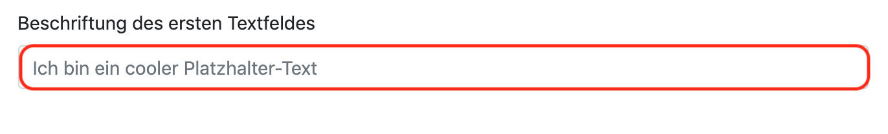
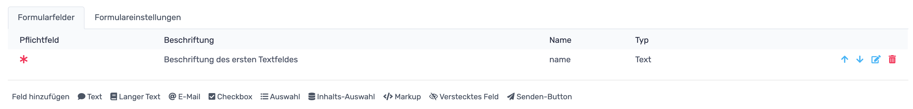

# RevisionTen Dokumentation
## 12. Fomulare

In der Sidebar unter der Kategorie: Struktur ist der Reiter: Formulare zu finden. 
Hier können Formulare erstellt und bearbeitet werden. 
Um ein Menü zu erstellen muss der grüne Formular-erstellen-Button geklickt werden. 
Ein Formular muss hier angelegt werden, damit es auf der Webseite als Element verfügbar ist.

Es öffnet sich ein Fenster, in dem Einstellungen für Formulare vorgenommen werden können. Dabei kann der 
1. Titel, 
2. die direkten Empfänger, 
3. der CC (carbon copy), 
4. der BCC (black carbon copy), 
5. der Absender, 
6. das Zeitlimit (wann darf derselbe Benutzer erneut ein Formular absenden), 
7. die Zeitlimit-Nachricht (was wird angezeigt, wenn der Benutzer versucht ein Formular zu senden, obwohl noch nicht genug Zeit vergangen ist), 
8. ein Email-Template (Vorlage, die in der Mail dem Empfänger gesendet wird), 
9. ein Email-CC/BCC-Template (Vorlage, die in der Mail den CC/BCC gesendet wird), 
10. ein Bestätigungstext (Text, der angezeigt wird, wenn das Formular versandt worden ist) 
11. und ein optionaler twig-template-Pfad (Verlinkung auf ein twig-Dokument, in dem ein Formular angelegt ist).
Zusätzlich kann über Checkboxen eingestellt werden, ob das Formular als 
1. HTML versendet werden soll, 
2. die Einsendungen unter der Kategorie: Struktur - Reiter: Einsendungen gespeichert werden soll, 
3. die Einsendung getrackt werden soll (hat der Empfänger die Mail geöffnet?) und 
4. ob der Formularschutz deaktiviert werden soll (Der Formularschutz schützt vor automatisierten Einsendungen, jedoch funktioniert dieser über Cookies, wodurch er in der Datenschutzerklärung berücksichtigt werden muss). 

Klickt man auf den Speichern-Button und hat man alle notwendigen Felder in den Einstellungen ausgefüllt, wird man zur Formularfelder-bearbeiten-Seite geleitet. 

### Formular-Textfeld hinzufügen

Um ein einzeiliges Textfeld (z.B. Name oder Straße oder ähnliches) hinzuzufügen, muss auf den Textfeld-Button geklickt werden. 

Es öffnet sich ein detailliertes Menü. Als erstes soll eine Beschriftung eingetragen werden. Diese Beschriftung steht im Frontend neben dem eigentlichen Textfeld, wie z.B. hier:

Das nächste Feld, das auszufüllen ist, ist das Namensfeld. Es ist dazu da, bestimmte Formularfelder anzusprechen und deren Werte auslesen zu können. 
Soll man in das Feld seine Straße eintragen, so muss der Name des Feldes: strasse lauten. 
Als nächstes muss sich entschieden werden, ob das Feld ein Pflichtfeld sein soll. Setzt man bei diesem Feld ein Häkchen, kann das Formular nicht versendet werden, wenn dieses Feld nicht korrekt ausgefüllt ist. 
Setzt man das Häkchen bei Sperren, kann kein Wert in das Feld. In den meisten Formularen ist diese Funktion nicht notwendig und sollte mit Bedacht gesetzt werden (Werden die Häkchen bei Sperren und Pflichtfeld gesetzt ist das Formular schon nicht mehr abschickbar - deswegen ist dort Vorsicht geboten).  
Als nächstes kann der Haken bei Beschriftung ausblenden gesetzt werden. Ist dieses Häkchen gesetzt, wird die oben eingetragene Beschriftung ausgeblendet. Aus Usibility-Gründen sollte man dies lassen, jedoch möchten viele die Beschriftung ausblenden um Platz zu sparen.
In das nächste Feld kann ein Tipp eingetragen werden. Dieses Feld kann mittels einen Bootstrap-Popvers angesprochen werden. 

Der Platzhaltertext, der im nächsten Feld eingetragen werden kann, wird im Frontend im jeweiligen Feld angezeigt, wenn man noch nichts ins Feld eingetragen hat. 
In den nächsten beiden Feldern können die Minimal-und Maximallänge der Eingabe eingetragen werden. Dadurch kann zum Beispiel verhindert werden, dass ein Formular abgeschickt wird in dessen Namenszeile ein 23453546451346 zeichenlanger Name steht.
Wird das Häkchen bei "Dieses Feld als Betreffzeile verwenden" gesetzt, wird der Inhalt des Textfeldes in die Betreffzeile der Mail geschrieben, welche durch die Formularsendung ausgeführt wird.
Über die letzten beiden Checkboxen kann eingestellt werden, ob dieses Feld in der Mail als Absender Vorname oder Nachname verwendet werden soll.

Wurden alle Einstellungen getätigt, kann auf Speichern geklickt werden und das Formularfeld wird dem erstellten Formularfeld hinzugefügt.
