# RevisionTen Dokumentation
## 12. Formulare

In der Sidebar unter der Kategorie: Struktur ist der Reiter: Formulare zu finden. 
Hier können Formulare erstellt und bearbeitet werden. 
Um ein Menü zu erstellen muss der grüne Formular-erstellen-Button geklickt werden. 
Ein Formular muss hier angelegt werden, damit es auf der Webseite als Element verfügbar ist.

Es öffnet sich ein Fenster, in dem Einstellungen für Formulare vorgenommen werden können. Dabei kann der 
1. Titel, 
2. die direkten Empfänger, 
3. der CC (carbon copy), 
4. der BCC (black carbon copy), 
5. der Absender, 
6. das Zeitlimit (wann darf derselbe Benutzer erneut ein Formular absenden), 
7. die Zeitlimit-Nachricht (was wird angezeigt, wenn der Benutzer versucht ein Formular zu senden, obwohl noch nicht genug Zeit vergangen ist), 
8. ein Email-Template (Vorlage, die in der Mail dem Empfänger gesendet wird), 
9. ein Email-CC/BCC-Template (Vorlage, die in der Mail den CC/BCC gesendet wird), 
10. ein Bestätigungstext (Text, der angezeigt wird, wenn das Formular versandt worden ist) 
11. und ein optionaler twig-template-Pfad (Verlinkung auf ein twig-Dokument, in dem ein Formular angelegt ist).
Zusätzlich kann über Checkboxen eingestellt werden, ob das Formular als 
1. HTML versendet werden soll, 
2. die Einsendungen unter der Kategorie: Struktur - Reiter: Einsendungen gespeichert werden soll, 
3. die Einsendung getrackt werden soll (hat der Empfänger die Mail geöffnet?) und 
4. ob der Formularschutz deaktiviert werden soll (Der Formularschutz schützt vor automatisierten Einsendungen, jedoch funktioniert dieser über Cookies, wodurch er in der Datenschutzerklärung berücksichtigt werden muss). 

Klickt man auf den Speichern-Button und hat man alle notwendigen Felder in den Einstellungen ausgefüllt, wird man zur Formularfelder-bearbeiten-Seite geleitet. 

### Formular: Textfeld hinzufügen

Um ein einzeiliges Textfeld (z.B. Name oder Straße oder ähnliches) hinzuzufügen, muss auf den Textfeld-Button geklickt werden. 

Es öffnet sich ein detailliertes Menü. Als erstes soll eine Beschriftung eingetragen werden. Diese Beschriftung steht im Frontend neben dem eigentlichen Textfeld, wie z.B. hier:

Das nächste Feld, das auszufüllen ist, ist das Namensfeld. Es ist dazu da, bestimmte Formularfelder anzusprechen und deren Werte auslesen zu können. 
Soll man in das Feld seine Straße eintragen, so muss der Name des Feldes: strasse lauten. 
Als nächstes muss sich entschieden werden, ob das Feld ein Pflichtfeld sein soll. Setzt man bei diesem Feld ein Häkchen, kann das Formular nicht versendet werden, wenn dieses Feld nicht korrekt ausgefüllt ist. 
Setzt man das Häkchen bei Sperren, kann kein Wert in das Feld. In den meisten Formularen ist diese Funktion nicht notwendig und sollte mit Bedacht gesetzt werden (Werden die Häkchen bei Sperren und Pflichtfeld gesetzt ist das Formular schon nicht mehr abschickbar - deswegen ist dort Vorsicht geboten).  
Als nächstes kann der Haken bei Beschriftung ausblenden gesetzt werden. Ist dieses Häkchen gesetzt, wird die oben eingetragene Beschriftung ausgeblendet. Aus Usibility-Gründen sollte man dies lassen, jedoch möchten viele die Beschriftung ausblenden um Platz zu sparen.
In das nächste Feld kann ein Tipp eingetragen werden. Dieses Feld kann mittels einen Bootstrap-Popovers angesprochen werden. 

Der Platzhaltertext, der im nächsten Feld eingetragen werden kann, wird im Frontend im jeweiligen Feld angezeigt, wenn man noch nichts ins Feld eingetragen hat. 
In den nächsten beiden Feldern können die Minimal-und Maximallänge der Eingabe eingetragen werden. Dadurch kann zum Beispiel verhindert werden, dass ein Formular abgeschickt wird in dessen Namenszeile ein 23453546451346 zeichenlanger Name steht.
Wird das Häkchen bei "Dieses Feld als Betreffzeile verwenden" gesetzt, wird der Inhalt des Textfeldes in die Betreffzeile der Mail geschrieben, welche durch die Formularsendung ausgeführt wird.
Über die letzten beiden Checkboxen kann eingestellt werden, ob dieses Feld in der Mail als Absender Vorname oder Nachname verwendet werden soll.

Wurden alle Einstellungen getätigt, kann auf Speichern geklickt werden und das Formularfeld wird dem erstellten Formularfeld hinzugefügt.

### Formular: Langes Textfeld hinzufügen

Um ein langes Textfeld (z.B. das Textfeld einer Nachricht) hinzuzufügen, muss auf den Langes-Textfeld-Button geklickt werden. 

Die Eingabemöglichkeiten entsprechen größtenteils der des einzeiligen Textfeldes. 
Das lange Textfeld ist für längere Eingaben gedacht. Gängige Beschriftungen dafür könnten z. B. "Ihre Nachricht:" sein. Ein passender Name wäre so etwas wie: "message". (Dabei sollte aber darauf geachtet werden, dass die Namen unterschiedlich gewählt werden wie zum einzeiligen Textfeld.)

  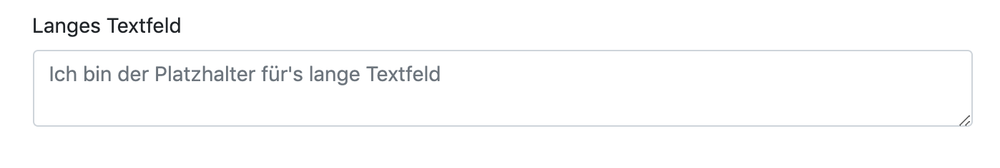
  
  So sieht das lange Textfeld im Frontend aus. 
### Formular: Email hinzufügen
  

Um ein Email-Feld (z.B. das Feld in das man eine Email eintragen soll) hinzuzufügen, muss auf Email-Button geklickt werden. 

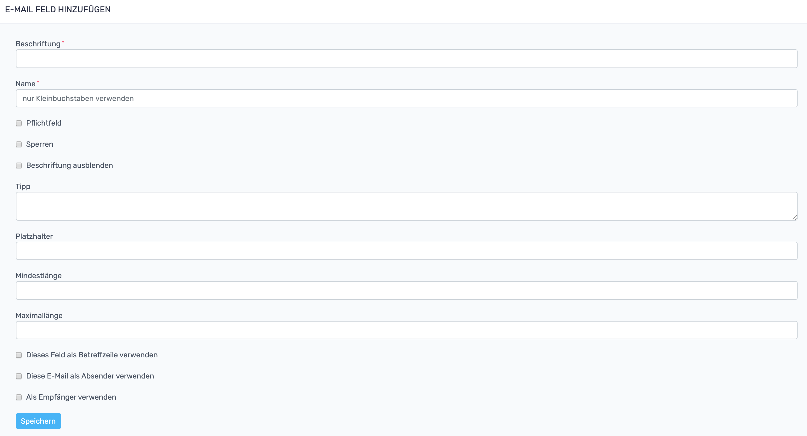

Die Eingabemöglichkeiten entsprechen größtenteils der des einzeiligen Textfeldes. 
Gängige Beschriftungen hierfür lauten so etwas wie: "Ihre Email-Adresse" und der dazugehörige Name würde: "email" lauten. 
Ansonsten unterscheiden sich die Einstellungsmöglichkeiten nur in den Checkboxen. 
Setzt man das Häkchen bei "dieses Feld als Empfänger" kann dem Kunden (sofern er seine E-Mail richtig eingetragen hat) auch eine Bestätigungsemail gesendet werden, dass das Kontaktformular erfolgreich gesendet wurde. Dabei muss jedoch beachtet werden, dass die entsprechende Zieladresse in den Formulareinstellungen in den BCC mit aufgenommen wird. (Diese Option wird nicht empfohlen und ist nur der Vollständigkeit halber mit aufgenommen.)

So sieht das Email-Feld im Frontend aus.

### Formular: Checkbox hinzufügen

Um eine Checkbox (z.B. eine Box womit ABGs akzeptiert werden können) hinzuzufügen, muss auf Checkbox-Button geklickt werden. 

Einer Checkbox können nur die Eigenschaften: Beschriftung, Name, Pflichtfeld und Sperrung gegeben werden. Um beim Beispiel zu bleiben, würde man hier für die Beschriftung: ABGs, für den Namen: agb eintragen und das Pflichtfeld abhaken. Die Sperrung würde nicht gesetzt werden, da man in diesem Fall möchte, dass man die Checkbox im Frontend abhaken können soll. 

Per Klick auf den Speichern-Button, ist die Checkbox nun auch im Frontend sichtbar.
### Formular: Auswahl hinzufügen

Um eine Auswahl(liste) (z.B. eine Liste aus der eine Kleidergröße ausgewählt werden kann) hinzuzufügen, muss auf den Auswahl-Button geklickt werden. 

Es öffnet sich ein Fenster, in welchem die verschiedenen Einstellungsmöglichkeiten zu diesem Feld eingetragen werden können. Die meisten Eigenschaften sind analog zu den übrigen Feldern zu sehen. Um beim Beispiel zu bleiben, würde man als Beschriftung: Kleidergröße wählen und als Name: size
Eine Besonderheit stellt hier das Auswahlen-Feld dar.
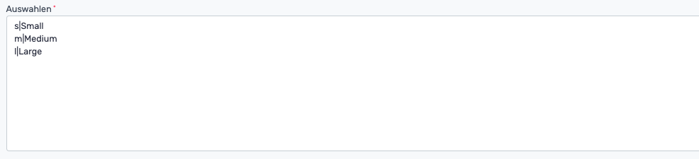
Hier können die verschiedenen Optionen, die man auswählen kann, eingetragen werden. Zuerst wird der Wert eingetragen und mit einer | (wird pipe ausgesprochen) von der Beschriftung getrennt. Um mehrere Optionen einzufügen, trennt man die einzelnen Eingaben mit einem Umbruch (Enter-Taste). Um beim Beispiel zu bleiben, trägt man also s|Small, m|Medium und l|Large jeweils getrennt mit einer Enter-Taste ein und erhält im Frontend dieses hier: 

Der Klick auf die "Als Optionsfelder/Checkboxen anzeigen"-Checkbox verändert die Anzeige im Frontend wie folgt:
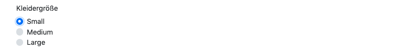
Mit dem Anhaken der "Mehrfachauswahl erlauben"-Checkbox können mehrere Optionen gleichzeitig angehakt werden. 
Mit der letzten Checkbox kann eingestellt werden, ob die Auswahl als Empfänger verwendet werden soll. Das würde allerdings nur Sinn ergeben, wenn die Auswahlliste aus Emails oder Namen besteht. 
Per Klick auf den Speichern-Button, ist die Auswahl nun auch im Frontend sichtbar.
### Formular: Inhalts-Auswahl hinzufügen
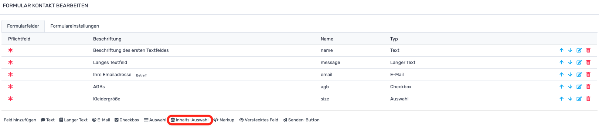
Um eine Inhalts-Auswahl(liste) (z.B. eine Liste aus der Filialen ausgewählt werden können) hinzuzufügen, muss auf den Auswahl-Button geklickt werden. 
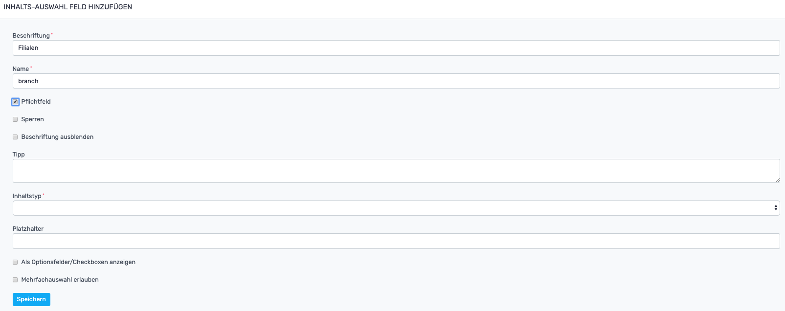
Es öffnet sich ein Fenster, in welchem die verschiedenen Einstellungsmöglichkeiten zu diesem Feld eingetragen werden können. Die meisten Eigenschaften sind analog zu den übrigen Feldern zu sehen. Um beim Beispiel zu bleiben, würde man als Beschriftung: Filialen wählen und als Name: branch
Eine Besonderheit stellt hier das Feld: Inhaltstyp dar. 
Wenn es beispielsweise 30 Filialen gibt, möchte man die nicht manuell eintragen müssen. Ein fachkundiger IT-Mensch Ihrer Wahl kann diese Filialen als Entitäten im Backend hinterlegen. Dadurch können die Filialen dann über das Feld: Inhaltstyp ausgewählt werden und müssen nicht wie bei dem Formularfeld: Auswahl alle manuell eingetragen werden. Die übrigen Einstellungsmöglichkeiten entsprechen jedoch denen des Auswahl-Formularfeldes. 
### Formular: Markup hinzufügen
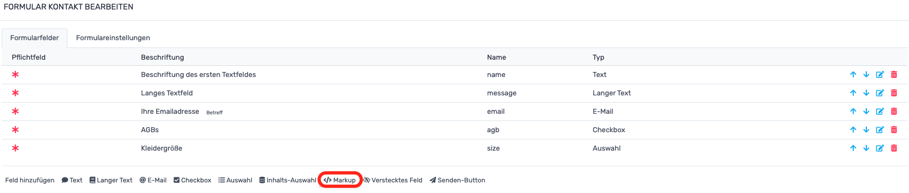
Um eine Inhalts-Auswahl(liste) (z.B. ein einfacher Informationstext innerhalb eines Formulars) hinzuzufügen, muss auf den Markup-Button geklickt werden. 
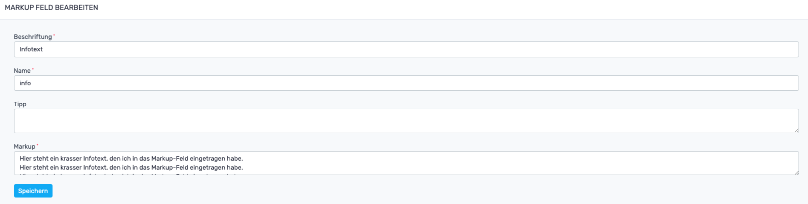
Es öffnet sich ein Fenster, in welchem die verschiedenen Einstellungsmöglichkeiten zu diesem Feld eingetragen werden können. Die meisten Eigenschaften sind analog zu den übrigen Feldern zu sehen. Um beim Beispiel zu bleiben, würde man als Beschriftung: Infotext wählen und als Name: info. In das Markup-Feld trägt man den eigentlichen Text ein, da standardmäßig weder Beschriftung noch Name angezeigt werden. Im Frontend sieht das Markup-Feld so aus:
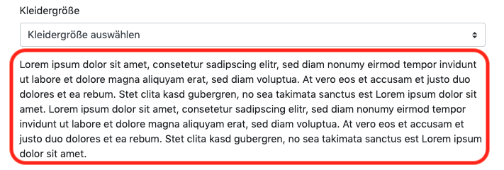
### Formular: Verstecktes Feld hinzufügen
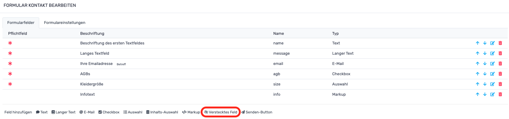
Um ein verstecktes Feld (z.B. wenn man Daten mit einem Formular senden möchte, die der Sender nicht ändern können soll - hier kann bspw. eine Seiten-URL oder ein Fahrzeugname gespeichert werden) hinzuzufügen, muss auf den Verstecktes-Feld-Button geklickt werden. 
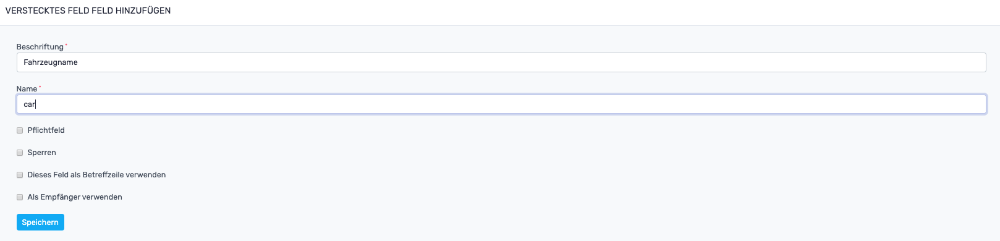
Es öffnet sich ein Fenster, in welchem die verschiedenen Einstellungsmöglichkeiten zu diesem Feld eingetragen werden können. Um beim Beispiel zu bleiben, würde man als Beschriftung: Fahrzeugname wählen und als Name: car. Im Frontend sieht das versteckte Feld so aus:
 🤯
### Formular: Senden-Button hinzufügen
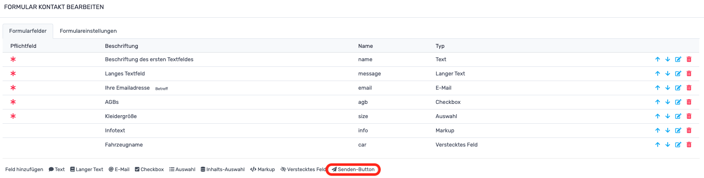
Um einen Senden-Button (der Knopf, der das Formular letzten Endes versendet) hinzuzufügen, muss auf den Senden-Button-Button 🧐 geklickt werden. 

Es öffnet sich ein Fenster, in welchem die verschiedenen Einstellungsmöglichkeiten zu diesem Feld eingetragen werden können. Als Beschriftung trägt man den Text ein, der auf dem Knopf stehen soll. In diesem Fall wurde: Formular rausfeuern gewählt. Als Name kann z. B. send verwendet werden. Im Frontend sieht der Button so aus:
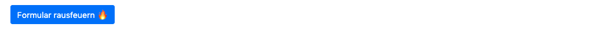
Wenn nach kurzer Zeit die Nachricht angezeigt wird, die zu Beginn als Bestätigungsnachricht eingetragen wurde, wurde das Formular versandt und kann, falls in den Formulareinstellungen - Einsendungen speichern - gewählt wurde, nun unter der Kategorie: Struktur unter dem Reiter: Einsendungen eingesehen werden.