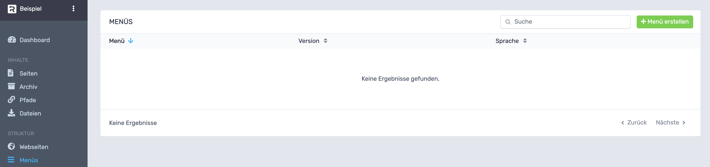
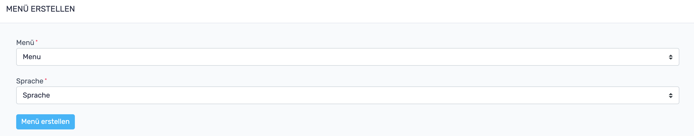

# RevisionTen Dokumentation
## 11. Menüs

In der Sidebar unter der Kategorie: Struktur ist der Reiter: Menüs zu finden. 
Hier können Menüs erstellt und bearbeitet werden. 
Um ein Menü zu erstellen muss der grüne Menü-erstellen-Button geklickt werden. 

Es öffnet sich ein Fenster, in dem die Art des Menüs und die Sprache ausgewählt werden muss. Dabei hat man die 
Wahl zwischen der Erstellung eines Hauptmenüs und eines Footermenüs. Per Klick auf "Menü erstellen" wird das 
ausgewählte Menü angelegt und man wird zur Menü-Übersicht geleitet.

### Seiten-Menüpunkt erstellen

Als Beispiel erstellen wir nun ein Hauptmenü in der Navigationsleiste. Dazu Klickt man auf "Menüpunkt-hinzufügen" 
und wählt "Seite-Menüpunkt" aus. Bei dieser Option können bereits erstellte Seiten als Verlinkung im Menü ausgewählt 
werden. 

Diese Art von Menüpunkten wird am meisten verwendet, da im Menü meistens auf Unterseiten der Webseite verlinkt 
werden soll.

### Link-Menüpunkt erstellen

Soll im Hauptmenü auf eine externe Seite verlinkt werden, empfiehlt es sich, beim Menüpunkt hinzufügen, die Option 
"Link-Menüpunkt- hinzufügen" zu wählen. Im Fenster, das sich nach der Auswahl öffnet, kann den Punkt einen Titel 
und eine URL eingegeben werden, auf welche der Menüpunkt dann verlinken wird. Außerdem empfiehlt es sich bei 
externen Links diesen Link in einem neuem Fenster zu öffnen, da sich der Seitenbesucher sonst nicht mehr auf
 deiner Seite befindet.

### Trennlinien-Menüpunkt erstellen
Das letzte Menü-Element ist der Trennlinien-Menüpunkt. Dieser ist eigentlich kein Menüpunkt, sondern bloß eine 
Trennlinie zwischen zwei Menüpunkten. 

Man fügt eine Trennungslinie hinzu, indem man in der Menü-Übersicht "Trennlinie-Menüpunkt hinzufügen" auswählt 
und im sich öffnenden Fenster auf "Speichern" klickt.
Trennungslinien werden besonders in sogenannten Dropdown-Menüs hilfreich, da sie die einzelnen Unterpunkte 
voneinander separieren. 

### Dropdown-Menü anlegen

Um ein Dropdown-Menü zu erstellen, können Menüpunkte an deren Steuerkreuz mit der Maus angefasst werden und 
per Drag-and-Drop eine Ebene tiefer an einen anderen Menüpunkt geschachtelt werden. Ist man mit der Menüstruktur 
zufrieden, klickt man auf "Menüstruktur-speichern". 
Im Frontend sieht das Menü dann wie folgt aus:

### Menü bearbeiten
Menüunterpunkte können entweder am Steuerkreuz per Drag-and-Drop verschoben werden oder mit den Pfeilen nach oben bzw. nach unten geschoben werden. 

Per Klick auf den Plus-Button kann ein Menüpunkt eine Ebene tiefer, also als Unterpunkt eines Dropdown-Menüs hinzugefügt werden.

Um einen Menüpunkt auszublenden, klickt man ganz einfach auf das Auge. 

Um den Menüpunkt wieder einzublenden, klickt man einfach auf das rote durchgestrichene Auge.

Um einen Menüpunkt zu bearbeiten, muss der Bearbeiten-Button geklickt werden. Es öffnet sich ein Menü, das dem Menü beim Hinzufügen eines Menüspunkts entspricht. 

Per Klick auf den roten Eimer kann ein Menüpunkt gelöscht werden.   