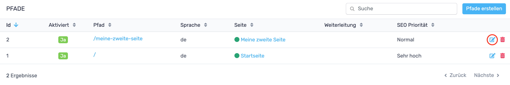

# RevisionTen Dokumentation
## 8. Pfade

In der Sidebar unter der Kategorie: Inhalte ist der Reiter: Pfade zu finden. 
Hier können die Pfade bzw. die URLs unter denen die Seiten im Browser auffindbar sein sollen geändert werden, 
neue Pfade erstellt oder gelöscht werden. 
### Pfade erstellen

Um einen neuen Pfad anzulegen, muss in der Pfadübersicht auf den Pfad-erstellen-Button geklickt werden. 
Es öffnet sich ein Fenster, in dem der Pfad, die Sprache, die jeweilige Seite, eine Weiterleitung und die 
SEO-Priorität eingestellt werden kann. 
### Pfade bearbeiten

Per Klick auf den Bearbeiten-Button öffnet sich ein Fenster, in dem der Pfad, die Sprache, die jeweilige Seite, 
eine Weiterleitung und die SEO-Priorität eingestellt werden kann. 
### Pfade löschen
Um einen Pfad zu löschen kann einfach in der Pfadübersicht oder der Detailansicht auf den roten Mülleimer geklickt 
werden.