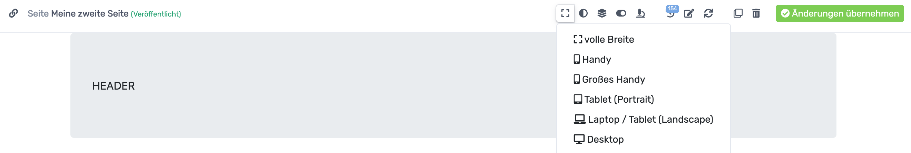
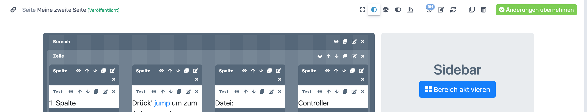
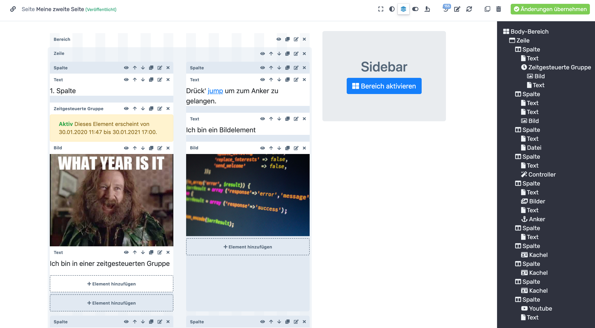
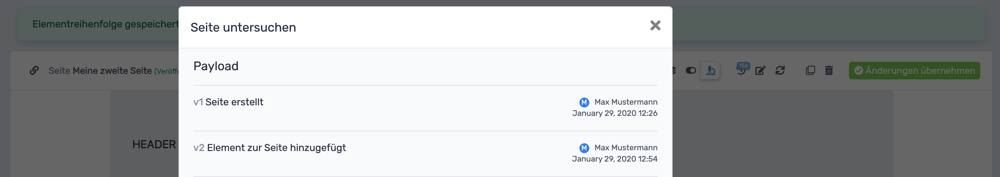
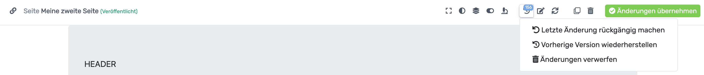
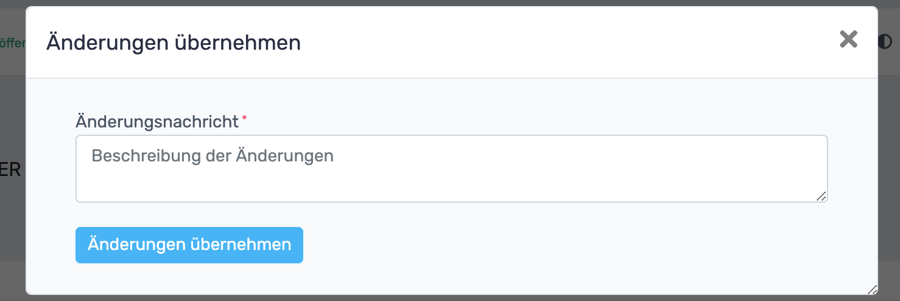


# RevisionTen Dokumentation

## 4. Ich möchte die Seite bearbeiten!
Die vorher festgelegten Einstellungen können ganz einfach geändert werden,   
indem in der Seitendetailansicht auf die Kopfleiste geklickt wird:  

### Anzeigegröße ändern

Per Klick auf den ersten Reiter der Leiste kann die Anzeigegröße eingestellt werden. 
Hier kann man je nach Option simulieren, wie die Webseite auf verschiedenen Bildschirmgrößen aussieht.
### Editor-Kontrast ändern

Mit einem Klick auf den nächsten Reiter kann der Editor-Kontrast gewechselt werden. 
Dadurch werden die Elemente der Seite im Editor dunkelgrau hinterlegt.
### Ebenen-Ansicht

Die Ebenen-Ansicht ist besonders nützlich, wenn es darum geht Inhalte auf der Seite zu verschieben.
 Per Klick auf den Ebenen-Reiter öffnet sich auf der rechten Seite ein Menü, 
 in welchem alle Seiteninhalte angezeigt werden. Fährt man mit der Maus über ein Element in diesem Menü,
  wird das Element auf der linken Seite markiert. 
  Via Drag-and-Drop kann das jeweilige Element einfach an eine andere Position auf der Seite manövriert werden. 
  Um die Positionierung zu speichern, 
  muss ganz unten in der Ebenen-Menü-Leiste auf den "Reihenfolge-speichern"-Button geklickt werden. 
 ### Seitenvorschau
 
 Um schnell und einfach überprüfen zu können, wie die Seiteninhalte ohne das Editorraster aussehen, 
 kann auf den Vorschau-Reiter geklickt werden. 
### Seite untersuchen

Per Klick auf das Untersuchen-Icon wird nach kurzer Ladezeit (2-3 Sekunden) ein Fenster geöffnet, 
in dem alle Aktionen, die auf der Seite ausgeführt wurden aufgelistet sind. 
### Revision

Falls man die Webseite kaputt gespielt haben sollte, kann man einfach wieder zu einem beliebigen Seitenstand zurückkehren. 
Dazu klickt man auf den Versionierungs-Button und kann auswählen, ob man die letzte Änderung rückgängig machen,
 eine vorherige Version wiederherstellen oder die gemachten Änderungen verwerfen möchte. 
 Bei der letzten Änderung wird nur die letzte ausgeführte Aktion rückgängig gemacht. 
 Bei der vorherigen Version kann zu einem beliebigen Stand der Webseite zurückgesprungen werden und
 beim Änderungen verwerfen werden alle Änderungen bis zur letzten Version verworfen. 
### Seiteneinstellungen ändern

Per Klick auf den Bearbeitungs-Button wird das Fenster aus Kapitel 3. [Seiten erstellen](Seiten-erstellen.md) aufgerufen, 
in dem die dort eingetragenen Einstellungen geändert werden können.

### Seite optimieren

Per Klick auf den Optimieren-Button wird die Performance im Backend-Bereich verbessert. 
Nach dem Klick verschwindet dieser Button. Wird der Button nicht angezeigt, 
besteht also auch kein Optimierungsbedarf.

### Seite duplizieren

Per Klick auf den Duplizieren-Button wird die Seite auf der man sich befindet dupliziert.
Man befindet sich sofort auf der duplizierten Seite und kann mit der Bearbeitung dieser starten. 
Ziemlich praktisch, wenn man viele Seiten mit gleichem Layout erstellen möchte!

### Seite löschen

Per Klick auf den Löschen-Button wird die Seite entfernt. 
No shit Sherlock!

### Änderungen übernehmen 

Damit zu jedem Änderungsstadium zugesprungen werden kann, müssen Änderungen übernommen werden und mit
 einer Beschreibung versehen werden, damit unterscheidbar ist, was beim jeweiligen Änderungsschritt gemacht wurde. 
 Dazu klickt man auf den großen grünen Änderung-übernehmen-Button, der sich rechts oben im Browserfenster befindet. 
Dadurch öffnet sich ein Fenster, in das die Änderungsbeschreibung eingetragen werden muss.

### Veröffentlichen

Wenn die Änderungen übernommen wurde, muss die Webseite noch veröffentlicht werden,
 damit sie für den Nutzer auch sichtbar ist. Das macht man ganz einfach über den großen 
 grünen Veröffentlichen-Button, der nun anstelle des Änderungen-übernehmen-Buttons angezeigt wird. 
 
### Unveröffentlichen

Das Veröffentlichen kann auch wieder rückgängig gemacht werden.
Dazu muss eine Seite jedoch erst veröffentlicht sein.
 Per Klick auf den großen roten Button oben rechts im Browserfenster wird die entsprechende Seite unveröffentlicht. 
