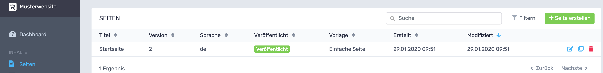
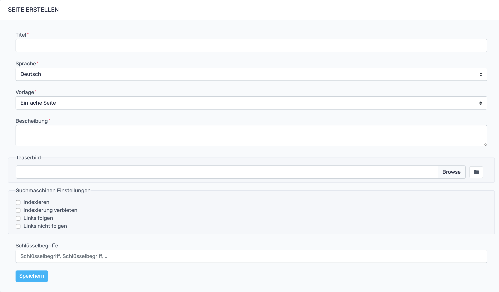


# RevisionTen Dokumentation

## 3. Ich möchte eine Seiten erstellen!
Um eine neue Seite mit RevTen zu erstellen, muss in der Sidebar unter der Kategorie: **Inhalte** auf den Reiter: **Seiten** geklickt werden. 
Das Menü sieht so aus:

Per Klick auf den grünen "Seite erstellen"-Button oben rechts öffnet sich ein Eingabefenster, das wie folgt aussieht:

Hier kann der neuen Website ganz einfach einen **Titel** gegeben werden. Der Titel gibt der Website ihren Namen unter welchem diese dann angezeigt werden kann. Die ausgewählte **Vorlage** legt fest, welches Layout der Seite zu Grunde liegt. Im Standard ist das die Vorlage "Einfache Seite". In das **Beschreibungsfeld** trägt man ein was einen auf der Seite erwartet. Hier freut sich euer SEO! Beim **Teaserbild** kann ein Bild hochgeladen werden, welches angezeigt werden kann, wenn auf anderen Seiten der URL auf diese Seite verlinkt wird. Unter dem Reiter **Suchmaschinen Einstellungen** kann Google & Co gesagt werden, wie mit der Website beim Crawlen umgegangen werden soll. In der Regel sollte hier **Indexieren** und **Links folgen** angeklickt werden. Als nächstes können besonders fleißige und gründliche Websitepfleger hier **Schlüsselbegriffe** eintragen. Wenn in alle relevanten Felder etwas eingetragen wurde, kann auf "Speichern" geklickt werden und eine neue Seite wurde erstellt! Yeah!

