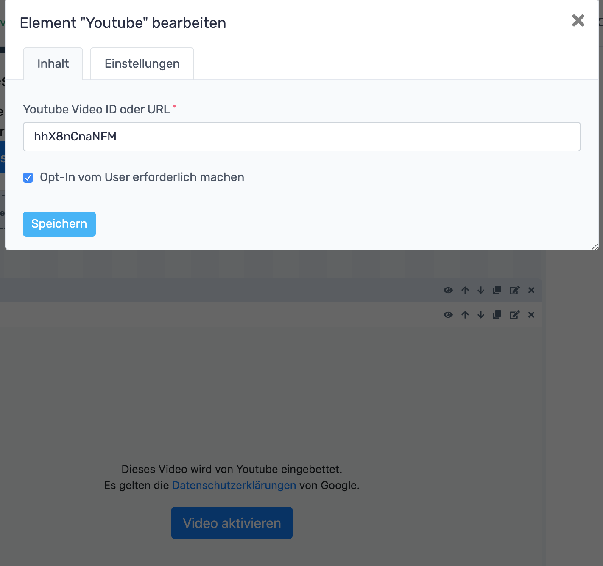

# RevisionTen Dokumentation

## 5. Ich möchte Inhalte auf der Seite einfügen!
Wenn gerade eine neue Seite erstellt wurde, befindet man sich bereits auf der Vorschauseite, auf der die Seite bearbeitet bzw. mit Inhalten befüllt werden kann. 
Ist das nicht der Fall, erreicht man diese Seite über die Sidebar unter der Kategorie: **Inhalte** und dann unter dem Reiter: **Seiten**. 

Als nächstes klickt man auf den "Bearbeiten"-Button und gelangt ebenfalls zur Bearbeitungsseite.
Wurde als Vorlage für die Seite "Einfache Seite" ausgewählt, sollte die angezeigte Seite so aussehen:
 
Links oben im Screenshot wird angezeigt, dass diese Seite noch nicht veröffentlicht ist. Das bedeutet, dass die Seite für ihre Kunden noch nicht sichtbar ist. An der Webseite kann also gefeilt werden, bis alles so aussieht wie es sein soll, ohne, dass ihre Kunden die Zwischenstände sehen. Ziemlich praktisch oder? 
Als nächstes möchte ich den Körper der Webseite einfügen, also den Bereich in dem die Hauptinhalte angezeigt werden. Hierzu muss der **Body-Bereich** aktiviert werden. Danach wird ein Bereich angezeigt, der ein 12er-Raster beinhaltet und in den eine Zeile eingefügt werden kann. RevTen benutzt dazu das HTML + CSS Framework Bootstrap, welches der Industriestandard ist. 

### Zeilen einfügen
Wird innerhalb des Bereichs nun auf "+ Zeile" geklickt, öffnet sich ein Fenster, in dem noch Feintuning zu diesem Element vorgenommen werden kann. 
In den meisten Fällen möchte man eine solche Zeile horizontal zentrieren, weshalb auf den Reiter **Einstellungen** im Eingabefenster geklickt werden kann und dort **horizontal zentrieren** angehakt werden kann. 
Wird hier auf "Speichern" geklickt, wird eine Zeile erstellt.
 
### Spalten einfügen
Im nächsten Schritt empfiehlt es sich, eine oder mehrere Spalten zu erstellen. Mehrspaltige Layouts gehören zum Standard im Webdesign und sind ganz einfach mit RevisionTen umsetzbar. Als Beispiel soll an dieser Stelle ein vierspaltiges Layout erstellt werden. Ruft man die Webseite mit einem Desktop-PC auf sollen vier Spalten dargestellt werden, auf einem Tablet sollen nur zwei Spalten nebeneinander angezeigt werden und auf einem Smartphone soll nur eine Spalte pro Reihe angezeigt werden. 
Hierzu klickt man auf "+ Spalte", wodurch sich ein Fenster öffnet, in welchem die Spaltengröße in Abhängigkeit von der Bildschirmbreite ausgewählt werden kann. Erstellt man vier solcher Spalten mit der oben gewählten Einstellung erhält man ein responsives Layout, welches sich an die Breite des verwendeten Bildschirms anpasst. In jede dieser Spalten können nun Elemente eingefügt werden. 

### Texte einfügen

Fügt man ein **Textelement** ein kann sogar per Klick auf den Quellcode-Editor HTML geschrieben werden wodurch noch mehr Textanpassungsmöglichkeiten vorhanden sind. 
Das Einfügen eines Formulars wird in einem eigenen Kapitel beschrieben, da dazu noch weitere Einstellungen vorgenommen werden müssen.

### Bild einfügen

Um ein **Bild** einzufügen, muss nur auf das Bild-Icon geklickt werden, wodurch sich ein weiteres Fenster öffnet, in welches der Titel des Bildes eingetragen werden muss und das entsprechende Bild hochgeladen werden kann. 

### Bilder einfügen

Es existiert außerdem ein Element, das **Bilder** heißt. Es ist dafür gedacht mehrere kleine Bilder nebeneinander auszurichten. Das können zum Beispiel eine Auflistung von Kundenlogos sein. 

### Datei einfügen

Das Einfügen einer **Datei** (z. B. ein PDF Dokument) funktioniert genauso wie das Einfügen eines Bildes. An dieser Stelle können jedoch auch bereits hochgeladene Dateien ausgewählt werden. Per Klick auf "Speichern" wird ein Button erzeugt, auf welchem der eingetragene Titel steht.

### Controller einfügen

Das nächste Element, was man einfügen kann, ist der **Controller**. Hier können vorgefertigte Funktionen wie z. B. eine **Suchleiste** eingebunden werden. 

### Zeitgesteuerte Gruppen einfügen

Die Anzeige von Elementen kann auch über die Zeit gesteuert werden. Dabei muss nur das Element: **Zeitgesteuerte Gruppe** ausgewählt werden und ein Start- und Enddatum eingegeben werden. 

Im nächsten Schritt muss innerhalb der nun entstandenen zeitgesteuerten Gruppe das Element eingefügt werden, welches nur in dem angegebenen Zeitraum angezeigt werden soll. 

### Anker einfügen (Link)

Um innerhalb einer Seite per Klick auf einen anderen Seitenbereich auf der Website zu springen gibt es sogenannte **Anker**. 

Dieser Seitenbereich kann jetzt mit Links angesteuert werden. Dazu kann man z. B. ein Textelement erstellen und in dieses Textelement einen Link einfügen, der auf den **Anker** verweist. Um einen Link zu erstellen, öffnet man ein Textelement, markiert das Wort, auf das man klicken soll und klickt auf das Kettensymbol im Texteditor. An dieser Stelle ist es wichtig die richtige URL einzutragen. Die URL der Seite muss um #ankerName erweitert werden.

### Kachel einfügen

Kacheln sind Verweise auf andere Unterseiten der Website. Diese Verweise besitzen ein Bild, einen kurzen Text und einen Knopf, durch dessen Klick auf die Unterseite weitergeleitet wird. Kacheln werden häufig für Blogartikel, Produkte oder Projektbeschreibungen verwendet. Erstellt man 3 Kacheln nebeneinander kann das in etwa so aussehen:

Das letzte Standardelement lautet **YouTube**. Dieses Element kann ganz einfach durch das Einfügen der YouTube-ID oder der URL erfolgen. 

### YouTube-Video einfügen

Dabei kann auch im Vorfeld eine Opt-In vom User erforderlich gemacht werden. Der User muss dann im Vorfeld erst das Video auf der Webseite aktivieren.

> Written with [StackEdit](https://stackedit.io/).

