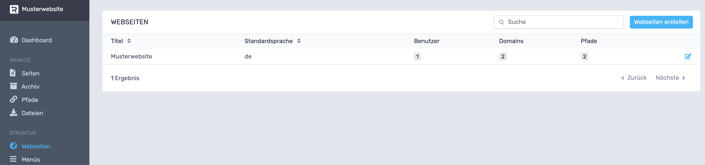
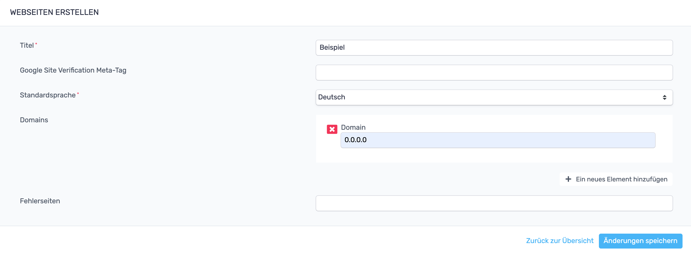
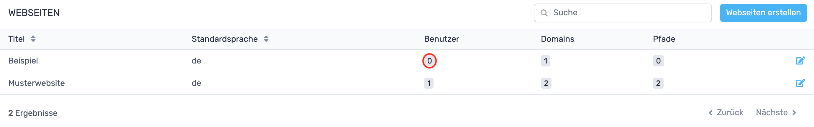
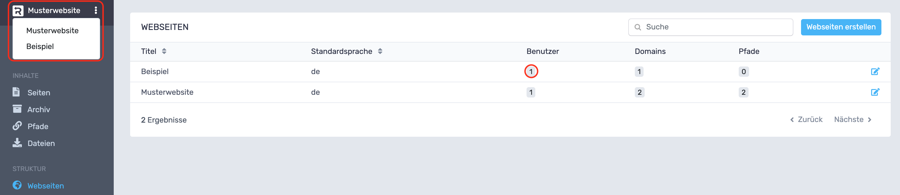
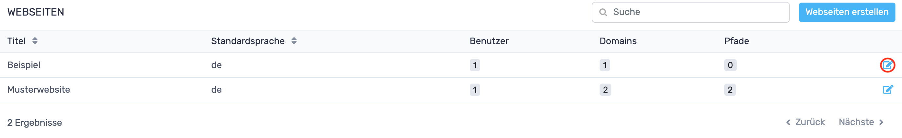

# RevisionTen Dokumentation
## 10. Webseiten erstellen

In der Sidebar unter der Kategorie: Struktur ist der Reiter: Webseiten zu finden. Klickt man auf diesen Reiter öffnet
 sich die Tabelle in der alle Webseiten gelistet sind. Temporär existiert nur eine Webseite, weshalb man nur diese 
 auswählen kann. Um eine neue Webseite zu erstellen, muss der blaue Button rechts oben geklickt werden. 

Es öffnet sich ein neues Fenster, in das Titel, Google Site Verification Meta Tag, Domains und Fehlerseiten 
eingetragen werden müssen, bzw. sollen.  Der Titel gibt der neuen Website den Namen. Das Google Site Verification 
Meta Tag bestätigt Google, dass das auch wirklich deine Seite ist, die du betreust. Das Tag kann in der Google 
Search Console unter Einstellungen > Bestätigung der Inhaberschaft > Andere Bestätigungsmethoden > HTML-Tag generiert
 und kopiert werden. Die Domains geben an unter welcher Adressen die Webseiten im Internet erreichbar sein sollen.
  Bei den Fehlerseiten kann eine Seite angegeben werden, die im Falle eines Webseitenfehlers angezeigt wird, wie 
  z. B. einem 404 Fehler.

Wird auf den Änderungen-speichern-Button geklickt, gelangt man zur Webseitenübersicht zurück und sieht nun,
 dass die Webseite erstellt worden ist. Jedoch ist der Webseite noch kein Benutzer zugeordnet, weshalb wir 
 temporär diese Webseite noch nicht bearbeiten können. Wie Benutzer  zugeordnet werden können, wird in 
 Kapitel [14. Benutzer](Benutzer.md) erklärt. 

Wurde ein Benutzer der Webseite zugeteilt, kann nun die neue Webseite im Menü rechts oben ausgewählt werden 
und Menüs, Unterseiten, usw. zu dieser Webseite erstellt werden.
### Webseiten bearbeiten

Wird auf den Bearbeiten-Button einer Webseite in der Webseitenübersicht geklickt, öffnet sich ein Fenster, 
das dem Fenster der Webseitenerstellung entspricht und die gleichen Einstellungsmöglichkeiten bietet. 
 